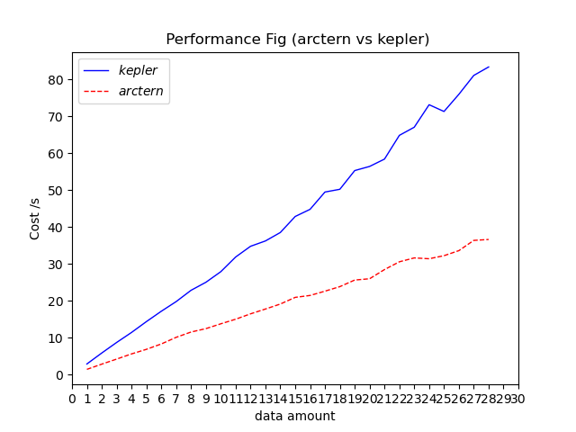

# arctern.pandas api vs kepler.gl

## 1. 测试数据
- 数据集：深圳运营车辆，2800w 行的 csv
- 数据量：测试 100w 到 2800w

## 2. 测试结果
- 
|数据量(百万)	  |1	|2	|3	|4	|5	|6	|7	|8	|9	|10	|11	|12	|13	|14	|15	|16	|17	|18	|19	|20	|21	|22	|23	|24	|25	|26	|27	|28|
| --------   | -----:   | :----: | :----: | :----: | :----: | :----: | :----: | :----: | :----: | :----: | :----: | :----: | :----: | :----: | :----: | :----: | :----: | :----: | :----: | :----: | :----: | :----: | :----: | :----: | :----: | :----: | :----: | :----: |
|kepler	|2.90	|5.87	|8.73	|11.44	|14.38	|17.18	|19.80	|22.86	|25.04	|27.91	|31.89	|34.79	|36.24	|38.52	|42.86	|44.81	|49.49	|50.24	|55.31	|56.43	|58.41	|64.85	|67.05	|73.15	|71.32	|75.97	|81.08	|83.38|
|arctern	|1.44	|2.85	|4.22	|5.62	|6.86	|8.32	|10.12	|11.55	|12.48	|13.78	|15.03	|16.48	|17.79	|19.14	|20.95	|21.47	|22.63	|23.85	|25.64	|25.99	|28.48	|30.59	|31.64	|31.41	|32.24	|33.61	|36.39	|36.63|

- 测试结果绘制折线图如下：

## 3. 测试脚本
见 [kerpler_vs_arctern.py](kepler_vs_arctern.py)