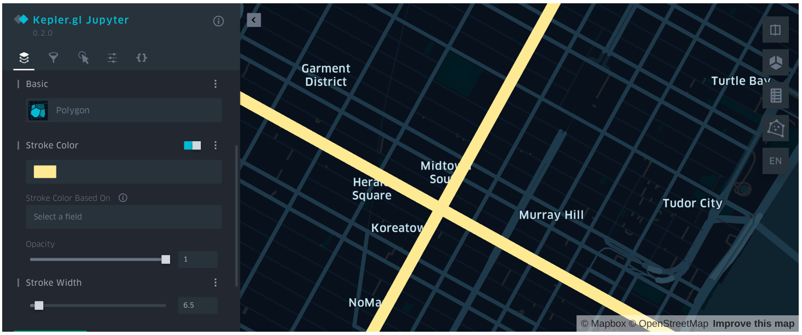

# Kepler.Gl 可视化

本文档引导你在 Jupyter 中使用 Kepler.Gl 直观地展示你的地理空间信息。

## 安装 Jupyter 和 Kepler.Gl

在 Conda 环境中，使用如下命令安装 Jupyter 和 Kepler.Gl：

```bash
$ conda install -c conda-forge jupyterlab
$ pip install keplergl
```

## 加载 keplergl 地图

**KeplerGl()**

&#x2002; &#x2003; 根据给定的配置参数，加载 keplergl 地图对象。

&#x2002; &#x2003; 参数

&#x2002; &#x2003; &#x2002; &#x2003; * height -- 可选参数，表示要显示的地图高度，默认值为 400。

&#x2002; &#x2003; &#x2002; &#x2003; * data(dict) -- 可选参数，输入的数据集，支持 CSV、GeoJSON、pandas.DataFrame、geopandas.GeoDataFrame、WKT 多种输入格式。

&#x2002; &#x2003; &#x2002; &#x2003; * config(dict) -- 可选参数，地图的配置信息。

### 示例

```python
# Load an empty map
from keplergl import KeplerGl
map_1 = KeplerGl()
map_1
```

加载一个空的地图。使用 KeplerGl() 接口创建一个地图对象 map_1，调用 map_1 将会在当前的 Jupyter 段落下方加载 Keplergl 的地图可视化部件。


## 添加数据

**.add_data()**

&#x2002; &#x2003; 给已有的地图对象添加输入数据。

&#x2002; &#x2003; 参数

&#x2002; &#x2003; &#x2002; &#x2003; * data -- 输入数据，支持 CSV、GeoJSON、pandas.DataFrame、geopandas.GeoDataFrame、WKT 多种输入格式。

&#x2002; &#x2003; &#x2002; &#x2003; * name -- 输入数据的名称。

### 示例

```python
import pandas as pd
# DataFrame
df = pd.DataFrame({'geos': ['LINESTRING (-73.996324 40.753388, -73.972088 40.743215)', 'LINESTRING (-73.989555 40.741531, -73.973952 40.762962)']})
map_1.add_data(data=df, name='data_1')
map_1
```

给 map_1 添加输入数据。调用 map_1 进行显示。还可以点击 Kepler.Gl 界面右上角的 **&gt;** 按钮以展开侧边栏，在其中进行图层属性设置：



同样，你还可以使用 CSV、GeoJSON 等数据格式添加输入数据：
```python
# CSV
with open('csv-data.csv', 'r') as f:
    csvData = f.read()
map_1.add_data(data=csvData, name='data_2')

# GeoJSON as string
with open('sf_zip_geo.json', 'r') as f:
    geojson = f.read()

map_1.add_data(data=geojson, name='geojson')
```

## 参考

更多操作及示例请参考 [keplergl-jupyter](https://docs.kepler.gl/docs/keplergl-jupyter)。
