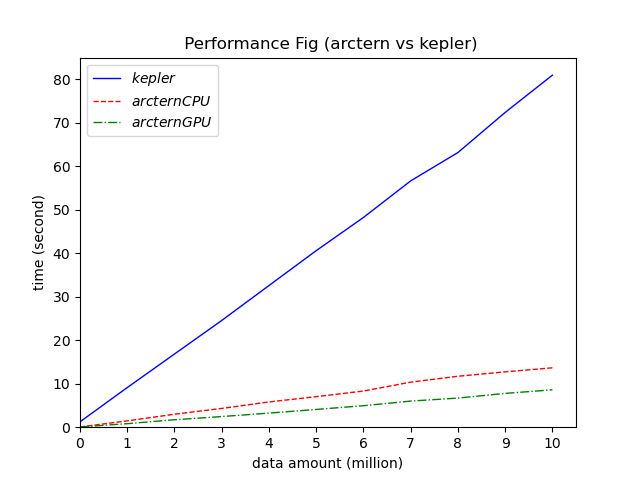

# arctern.pandas api vs kepler.gl

## 1. 测试数据
- 数据集：深圳运营车辆，1000w 行
- 数据量：测试 10 ( ≈ 0 ) 到 1000w，每次递增 100w

## 2. 测试结果

|数据量(百万)	  |≈ 0 |1	|2	|3	|4	|5	|6	|7	|8	|9	|10	|
| --------   | -----:   | :----: | :----: | :----: | :----: | :----: | :----: | :----: | :----: | :----: | :----: |
|**kepler**	|1.23|9.11|16.82|24.53|32.56|40.58|48.22|56.62|63.13|72.36|80.92|87.22|95.57|
|**arctern CPU**	|0.05|1.45|2.98|4.32|5.81|7.02|8.31|10.36|11.71|12.72|13.65|14.67|16.17|
|**arctern GPU**	|0.05|0.81|1.71|2.45|3.24|4.08|4.94|6.00|6.69|7.77|8.59|9.37|10.24|

- arctern CPU 平均比 kepler 快 5.72 倍;

- arctern GPU 平均比 kepler 快 9.84 倍。

测试结果绘制折线图如下：

## 3. 测试脚本
见 [KvsA.ipynb](KvsA.ipynb)