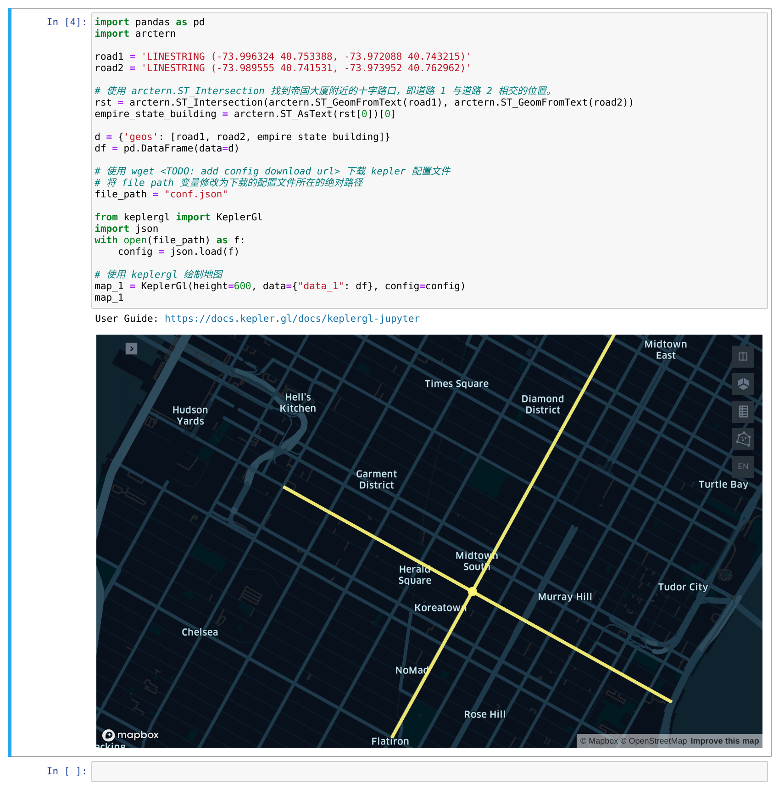

# 快速开始

## 环境搭建

### 安装 Arctern

请参考如下链接：

* [在线安装 Arctern Python 后台](../python/installation_and_deployment/install_arctern_on_python.md)

### 安装 Jupyter

在安装有 arctern 的 conda env 中运行如下命令：
```bash
$ conda install -c conda-forge jupyterlab
```

### 安装 keplergl

在安装有 arctern 的 conda env 中运行如下命令：
```bash
$ pip install keplergl
```

## 运行 jupyter-notebook

在以上环境搭建所创建的 conda env 中运行如下命令打开 jupyter notebook:
```bash
$ jupyter-notebook arctern-quick-start.ipynb
```

在打开的 jupyter 网页的段落代码中进行如下操作
1. 使用 wget <TODO: add config download url> 下载 kepler 配置文件;
2. 将 file_path 变量修改为下载的配置文件所在的绝对路径。

## 运行 arctern

点击网页的 `Run` 按钮运行 arctern，运行结果示例如下：


