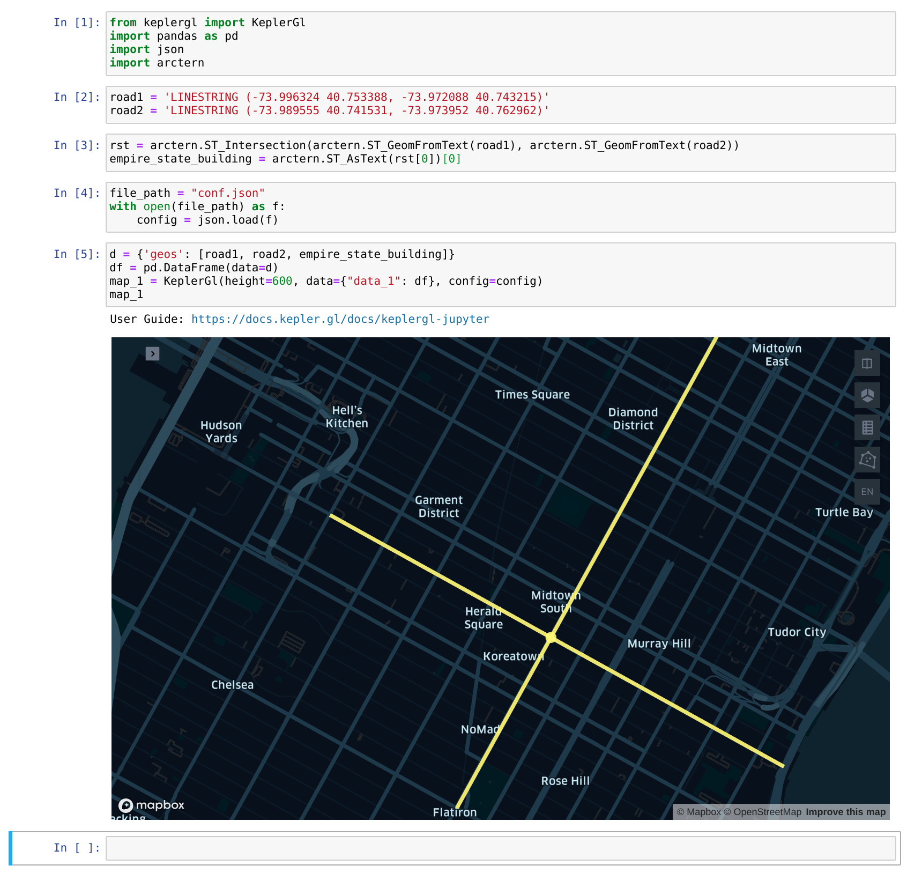

# 快速开始

## 环境搭建

### 安装 Arctern

请参考如下链接：

* [在线安装 Arctern Python 后台](../python/installation_and_deployment/install_arctern_on_python.md)

### 安装 Jupyter

在安装有 arctern 的 conda env 中运行如下命令：
```bash
$ conda install -c conda-forge jupyterlab
```

### 安装 keplergl

在安装有 arctern 的 conda env 中运行如下命令：
```bash
$ pip install keplergl
```

## 运行 jupyter-notebook

在以上环境搭建所创建的 conda env 中运行如下命令打开 jupyter notebook:
```bash
$ jupyter-notebook
```
在 jupyter 网页中新建一个 python3 的 notebook。

## 运行 arctern

> **注意：** 以下操作均在创建的 notebook 中运行。

1. 导入相关 arctern、keplergl 以及其他相关库。

```python
from keplergl import KeplerGl
import pandas as pd
import json
import arctern
```

2. 创建表示道路 1 与道路 2 的字符串对象。

```python
road1 = 'LINESTRING (-73.996324 40.753388, -73.972088 40.743215)'
road2 = 'LINESTRING (-73.989555 40.741531, -73.973952 40.762962)'
```

3. 使用 arctern.ST_Intersection 找到帝国大厦附近的十字路口，即道路 1 与道路 2 相交的位置。
```python
rst = arctern.ST_Intersection(arctern.ST_GeomFromText(road1), arctern.ST_GeomFromText(road2))
empire_state_building = arctern.ST_AsText(rst[0])[0]
```

4. 导入 kepler 配置文件。使用 wget <TODO: add config download url> 下载 kepler 配置文件，并将 file_path 变量修改为下载的配置文件所在的绝对路径。

```python
file_path = "</path/to/conf.json>"
with open(file_path) as f:
    config = json.load(f)
```

5. 使用 keplergl 绘制地图。
```python
d = {'geos': [road1, road2, empire_state_building]}
df = pd.DataFrame(data=d)
map_1 = KeplerGl(height=600, data={"data_1": df}, config=config)
map_1
```

以上过程运行示例及结果如下：


