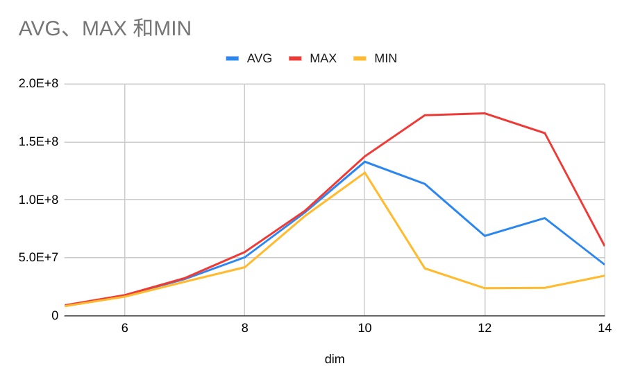

# AWS 2nodes Pulsar Throughput Test Result

测试环境：

- AWS: c5.4xlarge 双节点

## 测试不同 dim

固定 topic 数量为 128, producer 数量（即线程数量）为 258。
向量维度由 2^5 ~ 2^14 进行测试，每个维度测试 10 次。最后取 10 次的速度平均值、最大值以及最小值进行折线图绘制。

测试结果如下：

```txt
*************** total result average ***************
{"TopicNum":128,"ProducerNum":256,"VectorDim":128,"MsgLength":1048576,"DurationInMilliseconds":61270,"SpeedInCounter":17123.020551788337,"SpeedInBytes":8766986.522515628}
{"TopicNum":128,"ProducerNum":256,"VectorDim":256,"MsgLength":524288,"DurationInMilliseconds":30911,"SpeedInCounter":16967.91143454726,"SpeedInBytes":17375141.308976393}
{"TopicNum":128,"ProducerNum":256,"VectorDim":512,"MsgLength":262144,"DurationInMilliseconds":16959,"SpeedInCounter":15467.760695863917,"SpeedInBytes":31677973.905129302}
{"TopicNum":128,"ProducerNum":256,"VectorDim":1024,"MsgLength":131072,"DurationInMilliseconds":10720,"SpeedInCounter":12325.44376086538,"SpeedInBytes":50485017.6445046}
{"TopicNum":128,"ProducerNum":256,"VectorDim":2048,"MsgLength":65536,"DurationInMilliseconds":6031,"SpeedInCounter":10866.171353955351,"SpeedInBytes":89015675.73160224}
{"TopicNum":128,"ProducerNum":256,"VectorDim":4096,"MsgLength":32768,"DurationInMilliseconds":4045,"SpeedInCounter":8109.21257778445,"SpeedInBytes":132861338.87442043}
{"TopicNum":128,"ProducerNum":256,"VectorDim":8192,"MsgLength":16384,"DurationInMilliseconds":7253,"SpeedInCounter":3471.637145238058,"SpeedInBytes":113758605.97516069}
{"TopicNum":128,"ProducerNum":256,"VectorDim":16384,"MsgLength":8192,"DurationInMilliseconds":12088,"SpeedInCounter":1051.9368025119647,"SpeedInBytes":68939730.28942412}
{"TopicNum":128,"ProducerNum":256,"VectorDim":32768,"MsgLength":4096,"DurationInMilliseconds":10629,"SpeedInCounter":642.8187720512872,"SpeedInBytes":84255542.09030631}
{"TopicNum":128,"ProducerNum":256,"VectorDim":65536,"MsgLength":2048,"DurationInMilliseconds":12367,"SpeedInCounter":168.23372870396727,"SpeedInBytes":44101462.5773728}
*************** total result max ***************
{"TopicNum":128,"ProducerNum":256,"VectorDim":128,"MsgLength":1048576,"DurationInMilliseconds":59396,"SpeedInCounter":17653.837335508022,"SpeedInBytes":9038764.715780107}
{"TopicNum":128,"ProducerNum":256,"VectorDim":256,"MsgLength":524288,"DurationInMilliseconds":29982,"SpeedInCounter":17486.52958257345,"SpeedInBytes":17906206.292555213}
{"TopicNum":128,"ProducerNum":256,"VectorDim":512,"MsgLength":262144,"DurationInMilliseconds":16522,"SpeedInCounter":15866.33514130958,"SpeedInBytes":32494254.36940202}
{"TopicNum":128,"ProducerNum":256,"VectorDim":1024,"MsgLength":131072,"DurationInMilliseconds":9757,"SpeedInCounter":13432.420909846347,"SpeedInBytes":55019196.04673064}
{"TopicNum":128,"ProducerNum":256,"VectorDim":2048,"MsgLength":65536,"DurationInMilliseconds":5936,"SpeedInCounter":11040.285974376678,"SpeedInBytes":90442022.70209375}
{"TopicNum":128,"ProducerNum":256,"VectorDim":4096,"MsgLength":32768,"DurationInMilliseconds":3905,"SpeedInCounter":8390.240744607729,"SpeedInBytes":137465704.35965303}
{"TopicNum":128,"ProducerNum":256,"VectorDim":8192,"MsgLength":16384,"DurationInMilliseconds":3105,"SpeedInCounter":5276.444134838092,"SpeedInBytes":172898521.4103746}
{"TopicNum":128,"ProducerNum":256,"VectorDim":16384,"MsgLength":8192,"DurationInMilliseconds":3076,"SpeedInCounter":2662.663554832052,"SpeedInBytes":174500318.72947335}
{"TopicNum":128,"ProducerNum":256,"VectorDim":32768,"MsgLength":4096,"DurationInMilliseconds":3408,"SpeedInCounter":1201.7987978667759,"SpeedInBytes":157522172.03399405}
{"TopicNum":128,"ProducerNum":256,"VectorDim":65536,"MsgLength":2048,"DurationInMilliseconds":8937,"SpeedInCounter":229.15787082652213,"SpeedInBytes":60072360.88994782}
*************** total result min ***************
{"TopicNum":128,"ProducerNum":256,"VectorDim":128,"MsgLength":1048576,"DurationInMilliseconds":64590,"SpeedInCounter":16234.093807307123,"SpeedInBytes":8311856.029341247}
{"TopicNum":128,"ProducerNum":256,"VectorDim":256,"MsgLength":524288,"DurationInMilliseconds":32536,"SpeedInCounter":16113.689386530235,"SpeedInBytes":16500417.931806961}
{"TopicNum":128,"ProducerNum":256,"VectorDim":512,"MsgLength":262144,"DurationInMilliseconds":18272,"SpeedInCounter":14346.22252874598,"SpeedInBytes":29381063.738871768}
{"TopicNum":128,"ProducerNum":256,"VectorDim":1024,"MsgLength":131072,"DurationInMilliseconds":12818,"SpeedInCounter":10225.188384049412,"SpeedInBytes":41882371.62106639}
{"TopicNum":128,"ProducerNum":256,"VectorDim":2048,"MsgLength":65536,"DurationInMilliseconds":6241,"SpeedInCounter":10499.399248793905,"SpeedInBytes":86011078.64611967}
{"TopicNum":128,"ProducerNum":256,"VectorDim":4096,"MsgLength":32768,"DurationInMilliseconds":4351,"SpeedInCounter":7530.578014525471,"SpeedInBytes":123380990.18998532}
{"TopicNum":128,"ProducerNum":256,"VectorDim":8192,"MsgLength":16384,"DurationInMilliseconds":13124,"SpeedInCounter":1248.3751235606119,"SpeedInBytes":40906756.04883413}
{"TopicNum":128,"ProducerNum":256,"VectorDim":16384,"MsgLength":8192,"DurationInMilliseconds":22569,"SpeedInCounter":362.9673839419331,"SpeedInBytes":23787430.47401853}
{"TopicNum":128,"ProducerNum":256,"VectorDim":32768,"MsgLength":4096,"DurationInMilliseconds":22242,"SpeedInCounter":184.1559119215085,"SpeedInBytes":24137683.687375963}
{"TopicNum":128,"ProducerNum":256,"VectorDim":65536,"MsgLength":2048,"DurationInMilliseconds":15517,"SpeedInCounter":131.97828187072,"SpeedInBytes":34597314.72271802}
```


