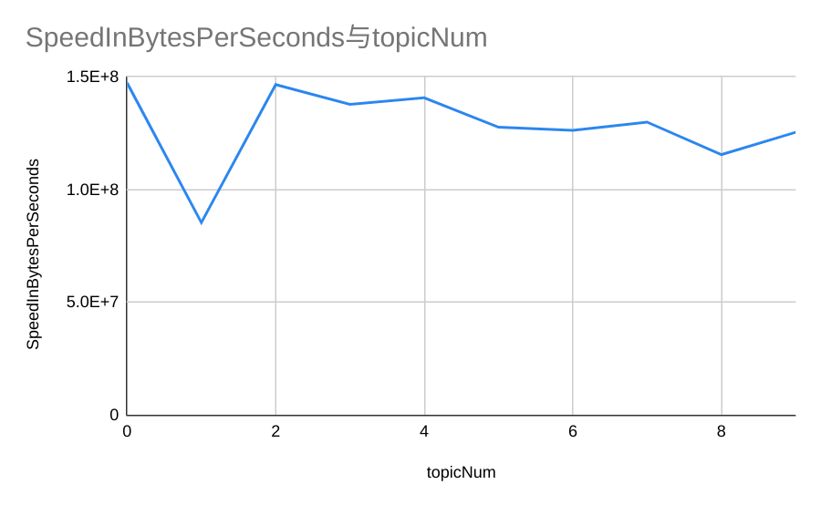
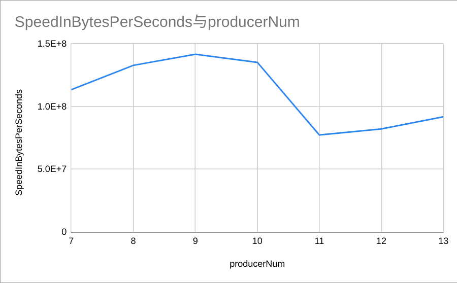
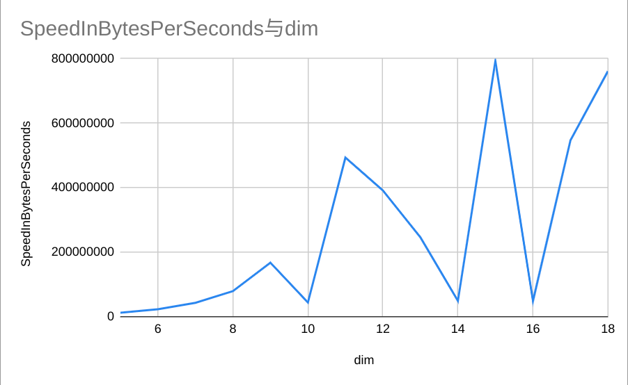

# Apache Pulsar Throughput Test Result

测试环境：

- OS: Ubuntu-18.04
- CPU： i7-8700(12核)
- SSD: 256G
- Memmory: 32G

## 1. 测试不同 Topic 数量

Topic 数量： 2^0 ~ 2^9

测试结果如下：

```bash
{"TopicNum":1,"ProducerNum":512,"VectorDim":512,"MsgLength":1048576,"DurationInMilliseconds":14577,"SpeedInCounter":71929.99182398632,"SpeedInBytes":147312623.25552398}
{"TopicNum":2,"ProducerNum":512,"VectorDim":512,"MsgLength":1048576,"DurationInMilliseconds":25123,"SpeedInCounter":41736.26646912261,"SpeedInBytes":85475873.7287631}
{"TopicNum":4,"ProducerNum":512,"VectorDim":512,"MsgLength":1048576,"DurationInMilliseconds":14651,"SpeedInCounter":71565.56933694132,"SpeedInBytes":146566286.00205582}
{"TopicNum":8,"ProducerNum":512,"VectorDim":512,"MsgLength":1048576,"DurationInMilliseconds":15577,"SpeedInCounter":67314.40239942344,"SpeedInBytes":137859896.11401922}
{"TopicNum":16,"ProducerNum":512,"VectorDim":512,"MsgLength":1048576,"DurationInMilliseconds":15257,"SpeedInCounter":68726.25482878106,"SpeedInBytes":140751369.88934362}
{"TopicNum":32,"ProducerNum":512,"VectorDim":512,"MsgLength":1048576,"DurationInMilliseconds":16818,"SpeedInCounter":62346.21057898,"SpeedInBytes":127685039.26575103}
{"TopicNum":64,"ProducerNum":512,"VectorDim":512,"MsgLength":1048576,"DurationInMilliseconds":17007,"SpeedInCounter":61655.455643631685,"SpeedInBytes":126270373.15815769}
{"TopicNum":128,"ProducerNum":512,"VectorDim":512,"MsgLength":1048576,"DurationInMilliseconds":16520,"SpeedInCounter":63470.22735788177,"SpeedInBytes":129987025.62894186}
{"TopicNum":256,"ProducerNum":512,"VectorDim":512,"MsgLength":1048576,"DurationInMilliseconds":18583,"SpeedInCounter":56424.735898112136,"SpeedInBytes":115557859.11933365}
{"TopicNum":512,"ProducerNum":512,"VectorDim":512,"MsgLength":1048576,"DurationInMilliseconds":17119,"SpeedInCounter":61250.565887557816,"SpeedInBytes":125441158.9377184}
```



## 2. 测试不同消息发布线程数量（即 producer 数）

消息发布线程数量： 2^7 ~ 2^13

测试结果如下：

```bash
{"TopicNum":4,"ProducerNum":128,"VectorDim":512,"MsgLength":1048576,"DurationInMilliseconds":18927,"SpeedInCounter":55399.75337658923,"SpeedInBytes":113458694.91525474}
{"TopicNum":4,"ProducerNum":256,"VectorDim":512,"MsgLength":1048576,"DurationInMilliseconds":16167,"SpeedInCounter":64858.28447986023,"SpeedInBytes":132829766.61475375}
{"TopicNum":4,"ProducerNum":512,"VectorDim":512,"MsgLength":1048576,"DurationInMilliseconds":15156,"SpeedInCounter":69182.70378546392,"SpeedInBytes":141686177.3526301}
{"TopicNum":4,"ProducerNum":1024,"VectorDim":512,"MsgLength":1048576,"DurationInMilliseconds":15882,"SpeedInCounter":66022.12012775178,"SpeedInBytes":135213302.02163565}
{"TopicNum":4,"ProducerNum":2048,"VectorDim":512,"MsgLength":1048576,"DurationInMilliseconds":27743,"SpeedInCounter":37795.95334973412,"SpeedInBytes":77406112.46025547}
{"TopicNum":4,"ProducerNum":4096,"VectorDim":512,"MsgLength":1048576,"DurationInMilliseconds":26123,"SpeedInCounter":40139.394365667176,"SpeedInBytes":82205479.66088638}
{"TopicNum":4,"ProducerNum":8192,"VectorDim":512,"MsgLength":1048576,"DurationInMilliseconds":23372,"SpeedInCounter":44864.36982192665,"SpeedInBytes":91882229.39530578}
```



## 3. 测试不同向量维度

向量维度： 2^5 ~ 2^18

测试结果如下：

```bash
{"TopicNum":4,"ProducerNum":512,"VectorDim":32,"MsgLength":4194304,"DurationInMilliseconds":43337,"SpeedInCounter":96782.63570694171,"SpeedInBytes":12388177.37048854}
{"TopicNum":4,"ProducerNum":512,"VectorDim":64,"MsgLength":2097152,"DurationInMilliseconds":23455,"SpeedInCounter":89410.43576119043,"SpeedInBytes":22889071.55486475}
{"TopicNum":4,"ProducerNum":512,"VectorDim":128,"MsgLength":1048576,"DurationInMilliseconds":12475,"SpeedInCounter":84053.67843538287,"SpeedInBytes":43035483.35891603}
{"TopicNum":4,"ProducerNum":512,"VectorDim":256,"MsgLength":524288,"DurationInMilliseconds":6790,"SpeedInCounter":77204.00749685889,"SpeedInBytes":79056903.6767835}
{"TopicNum":4,"ProducerNum":512,"VectorDim":512,"MsgLength":262144,"DurationInMilliseconds":3210,"SpeedInCounter":81646.74131822807,"SpeedInBytes":167212526.2197311}
{"TopicNum":4,"ProducerNum":512,"VectorDim":1024,"MsgLength":131072,"DurationInMilliseconds":12195,"SpeedInCounter":10747.335310125733,"SpeedInBytes":44021085.430275}
{"TopicNum":4,"ProducerNum":512,"VectorDim":2048,"MsgLength":65536,"DurationInMilliseconds":1088,"SpeedInCounter":60206.92337579808,"SpeedInBytes":493215116.29453784}
{"TopicNum":4,"ProducerNum":512,"VectorDim":4096,"MsgLength":32768,"DurationInMilliseconds":1372,"SpeedInCounter":23878.99020892318,"SpeedInBytes":391233375.5829974}
{"TopicNum":4,"ProducerNum":512,"VectorDim":8192,"MsgLength":16384,"DurationInMilliseconds":2181,"SpeedInCounter":7509.061958337179,"SpeedInBytes":246056942.25079268}
{"TopicNum":4,"ProducerNum":512,"VectorDim":16384,"MsgLength":8192,"DurationInMilliseconds":10940,"SpeedInCounter":748.7775666714862,"SpeedInBytes":49071886.60938252}
{"TopicNum":4,"ProducerNum":512,"VectorDim":32768,"MsgLength":4096,"DurationInMilliseconds":677,"SpeedInCounter":6042.987520544737,"SpeedInBytes":792066460.2928398}
{"TopicNum":4,"ProducerNum":512,"VectorDim":65536,"MsgLength":2048,"DurationInMilliseconds":11076,"SpeedInCounter":184.89956925297983,"SpeedInBytes":48470312.682253145}
{"TopicNum":4,"ProducerNum":512,"VectorDim":131072,"MsgLength":1024,"DurationInMilliseconds":981,"SpeedInCounter":1043.6674699118134,"SpeedInBytes":547182330.4651248}
{"TopicNum":4,"ProducerNum":512,"VectorDim":262144,"MsgLength":512,"DurationInMilliseconds":705,"SpeedInCounter":725.6665252349223,"SpeedInBytes":760916502.3647339}
```



## 4. 测试代码

```go
package main

import (
	"context"
	"encoding/binary"
	"encoding/json"
	"fmt"
	"github.com/apache/pulsar-client-go/pulsar"
	"log"
	"math"
	"math/rand"
	"os"
	"strconv"
	"sync"
	"time"
)

const TotalDataSizeInGB = 2
const URL = "pulsar://localhost:6650"

type Tester struct {
	testConfig TestConfig
	client     *pulsar.Client
	producers  []pulsar.Producer

	message    []byte
	msgCounter MsgCounter
	InsertLogs []InsertLog
}

type TestConfig struct {
	PulsarUrl    string
	PulsarTopic  string
	LogWritePath string

	ProducerNum       int
	TopicNum          int
	Dim               int
	TotalDataSizeInGB float32
}

type MsgCounter struct {
	InsertCounter int
	InsertTime    time.Time
}

type InsertLog struct {
	TopicNum               int
	ProducerNum            int
	VectorDim              int
	MsgLength              int
	DurationInMilliseconds int64
	SpeedInCounter         float64
	SpeedInBytes           float64
}

func (t *Tester) InitClient() {
	client, err := pulsar.NewClient(pulsar.ClientOptions{
		URL: t.testConfig.PulsarUrl,
	})
	if err != nil {
		log.Fatalf("Could not instantiate Pulsar client: %v", err)
	}

	t.client = &client
}

func (t *Tester) InitProducer() {
	topicsPerProducer := t.testConfig.ProducerNum / t.testConfig.TopicNum
	for i := 0; i < t.testConfig.TopicNum; i++ {
		for j := 0; j < topicsPerProducer; j++ {
			producer, err := (*t.client).CreateProducer(pulsar.ProducerOptions{
				Topic: t.testConfig.PulsarTopic + strconv.FormatInt(int64(i), 10),
			})
			if err != nil {
				log.Fatalf("Could not instantiate Pulsar client: %v", err)
			}
			t.producers = append(t.producers, producer)
		}
	}
}

func (t *Tester) GenerateMessage() {
	vec := make([]float32, 0)
	t.message = make([]byte, 0)

	for i := 0; i < t.testConfig.Dim; i++ {
		vec = append(vec, rand.Float32())
	}

	for _, ele := range vec {
		buf := make([]byte, 4)
		binary.LittleEndian.PutUint32(buf, math.Float32bits(ele))
		t.message = append(t.message, buf...)
	}
}

func (t *Tester) GenerateLog(length int) {
	t.msgCounter.InsertCounter += length
	timeNow := time.Now()
	duration := timeNow.Sub(t.msgCounter.InsertTime)
	speedInCounter := float64(length) / duration.Seconds()
	speedInBytes := float64(length*t.testConfig.Dim*4) / duration.Seconds()

	insertLog := InsertLog{
		TopicNum:               t.testConfig.TopicNum,
		ProducerNum:            t.testConfig.ProducerNum,
		VectorDim:              t.testConfig.Dim,
		MsgLength:              length,
		DurationInMilliseconds: duration.Milliseconds(),
		SpeedInCounter:         speedInCounter,
		SpeedInBytes:           speedInBytes,
	}

	t.InsertLogs = append(t.InsertLogs, insertLog)
	t.msgCounter.InsertTime = timeNow
	fmt.Println(insertLog)
}

func (t *Tester) WriteLog() {
	fileName := t.testConfig.LogWritePath

	f, err := os.OpenFile(fileName, os.O_APPEND|os.O_CREATE|os.O_WRONLY, 0644)
	if err != nil {
		log.Fatal(err)
	}

	// write logs
	for _, insertLog := range t.InsertLogs {
		insertLogJson, err := json.Marshal(&insertLog)
		if err != nil {
			log.Fatal(err)
		}

		writeString := string(insertLogJson) + "\n"
		fmt.Println(writeString)

		_, err2 := f.WriteString(writeString)
		if err2 != nil {
			log.Fatal(err2)
		}
	}

	// reset InsertLogs buffer
	t.InsertLogs = make([]InsertLog, 0)

	err = f.Close()
	if err != nil {
		log.Fatal(err)
	}

	fmt.Println("write log done")
}

func (t *Tester) sendMsg(wg *sync.WaitGroup, index int) {
	if _, err := t.producers[index].Send(context.Background(), &pulsar.ProducerMessage{
		Payload: t.message,
	}); err != nil {
		log.Fatal(err)
	}
	wg.Done()
}

func (t *Tester) Close() {
	for i := 0; i < t.testConfig.ProducerNum; i++ {
		t.producers[i].Close()
	}
	t.producers = make([]pulsar.Producer, 0)
	(*t.client).Close()
	t.client = nil
}

func (t *Tester) Run() {
	t.GenerateMessage()

	totalDataSize := int(t.testConfig.TotalDataSizeInGB * 1024 * 1024 * 1024)
	dataSizePerMsg := t.testConfig.Dim * 4
	sendTimes := totalDataSize / (dataSizePerMsg)

	t.msgCounter.InsertTime = time.Now()

	count := 0
	for {
		if count >= sendTimes {
			break
		}
		wg := sync.WaitGroup{}
		wg.Add(t.testConfig.ProducerNum)
		count += t.testConfig.ProducerNum
		for i := 0; i < t.testConfig.ProducerNum; i++ {
			go t.sendMsg(&wg, i)
		}
		wg.Wait()
	}

	t.GenerateLog(count)
}

func (t *Tester) RunTest(topicNum int, producerNum int, dim int) {
	t.testConfig.TopicNum = topicNum
	t.testConfig.ProducerNum = producerNum
	t.testConfig.Dim = dim

	t.InitClient()
	t.InitProducer()

	fmt.Println("test topicNum:", topicNum, "producerNum:", producerNum, "dim:", dim)
	t.Run()

	t.Close()
}

func TestTopicsNum() {
	conf := TestConfig{
		PulsarUrl:    URL,
		PulsarTopic:  "my-test",
		LogWritePath: "/tmp/throughput_topic_test.txt",

		TotalDataSizeInGB: TotalDataSizeInGB,
	}

	tester := Tester{
		testConfig: conf,
	}

	for i := 0; i < 10; i++{
		tester.RunTest(int(math.Pow(2, float64(i))), 512, 512)
	}

	tester.WriteLog()
}

func TestProducersNum() {
	conf := TestConfig{
		PulsarUrl:    URL,
		PulsarTopic:  "my-test",
		LogWritePath: "/tmp/throughput_producer_test.txt",

		TotalDataSizeInGB: TotalDataSizeInGB,
	}

	tester := Tester{
		testConfig: conf,
	}

	for i := 7; i < 14; i++{
		tester.RunTest(4, int(math.Pow(2, float64(i))), 512)
	}

	tester.WriteLog()
}

func TestDims() {
	conf := TestConfig{
		PulsarUrl:    URL,
		PulsarTopic:  "my-test",
		LogWritePath: "/tmp/throughput_dim_test.txt",

		TotalDataSizeInGB: TotalDataSizeInGB,
	}

	tester := Tester{
		testConfig: conf,
	}

	for i := 5; i < 19; i++{
		tester.RunTest(4, 512, int(math.Pow(2, float64(i))))
	}

	tester.WriteLog()
}

func main() {
	TestTopicsNum()
	TestProducersNum()
	TestDims()
}
```
