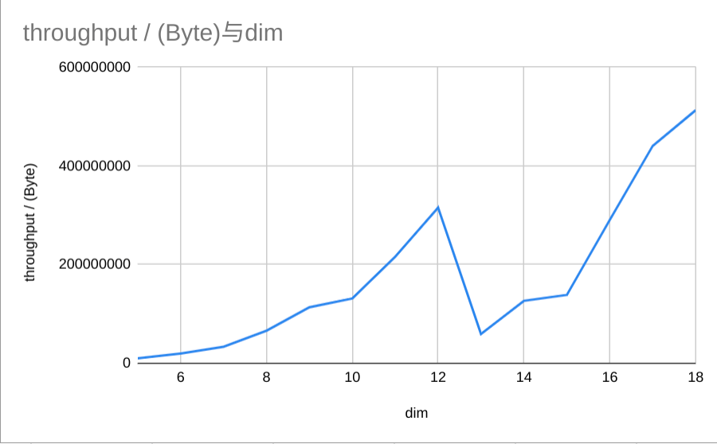

# Apache Pulsar Throughput Test Result

测试环境：

- OS: Ubuntu-18.04
- CPU： i7-8700(12核)
- SSD: 256G
- Memmory: 32G

## 1. 测试不同 Topic 数量

Topic 数量： 2^0 ~ 2^9

测试结果如下：

```bash
{"TopicNum":1,"ProducerNum":512,"VectorDim":512,"MsgLength":1048576,"DurationInMilliseconds":14577,"SpeedInCounter":71929.99182398632,"SpeedInBytes":147312623.25552398}
{"TopicNum":2,"ProducerNum":512,"VectorDim":512,"MsgLength":1048576,"DurationInMilliseconds":25123,"SpeedInCounter":41736.26646912261,"SpeedInBytes":85475873.7287631}
{"TopicNum":4,"ProducerNum":512,"VectorDim":512,"MsgLength":1048576,"DurationInMilliseconds":14651,"SpeedInCounter":71565.56933694132,"SpeedInBytes":146566286.00205582}
{"TopicNum":8,"ProducerNum":512,"VectorDim":512,"MsgLength":1048576,"DurationInMilliseconds":15577,"SpeedInCounter":67314.40239942344,"SpeedInBytes":137859896.11401922}
{"TopicNum":16,"ProducerNum":512,"VectorDim":512,"MsgLength":1048576,"DurationInMilliseconds":15257,"SpeedInCounter":68726.25482878106,"SpeedInBytes":140751369.88934362}
{"TopicNum":32,"ProducerNum":512,"VectorDim":512,"MsgLength":1048576,"DurationInMilliseconds":16818,"SpeedInCounter":62346.21057898,"SpeedInBytes":127685039.26575103}
{"TopicNum":64,"ProducerNum":512,"VectorDim":512,"MsgLength":1048576,"DurationInMilliseconds":17007,"SpeedInCounter":61655.455643631685,"SpeedInBytes":126270373.15815769}
{"TopicNum":128,"ProducerNum":512,"VectorDim":512,"MsgLength":1048576,"DurationInMilliseconds":16520,"SpeedInCounter":63470.22735788177,"SpeedInBytes":129987025.62894186}
{"TopicNum":256,"ProducerNum":512,"VectorDim":512,"MsgLength":1048576,"DurationInMilliseconds":18583,"SpeedInCounter":56424.735898112136,"SpeedInBytes":115557859.11933365}
{"TopicNum":512,"ProducerNum":512,"VectorDim":512,"MsgLength":1048576,"DurationInMilliseconds":17119,"SpeedInCounter":61250.565887557816,"SpeedInBytes":125441158.9377184}
```


## 2. 测试不同消息发布线程数量（即 producer 数）

消息发布线程数量： 2^7 ~ 2^13

测试结果如下：

```bash
{"TopicNum":4,"ProducerNum":128,"VectorDim":512,"MsgLength":1048576,"DurationInMilliseconds":18927,"SpeedInCounter":55399.75337658923,"SpeedInBytes":113458694.91525474}
{"TopicNum":4,"ProducerNum":256,"VectorDim":512,"MsgLength":1048576,"DurationInMilliseconds":16167,"SpeedInCounter":64858.28447986023,"SpeedInBytes":132829766.61475375}
{"TopicNum":4,"ProducerNum":512,"VectorDim":512,"MsgLength":1048576,"DurationInMilliseconds":15156,"SpeedInCounter":69182.70378546392,"SpeedInBytes":141686177.3526301}
{"TopicNum":4,"ProducerNum":1024,"VectorDim":512,"MsgLength":1048576,"DurationInMilliseconds":15882,"SpeedInCounter":66022.12012775178,"SpeedInBytes":135213302.02163565}
{"TopicNum":4,"ProducerNum":2048,"VectorDim":512,"MsgLength":1048576,"DurationInMilliseconds":27743,"SpeedInCounter":37795.95334973412,"SpeedInBytes":77406112.46025547}
{"TopicNum":4,"ProducerNum":4096,"VectorDim":512,"MsgLength":1048576,"DurationInMilliseconds":26123,"SpeedInCounter":40139.394365667176,"SpeedInBytes":82205479.66088638}
{"TopicNum":4,"ProducerNum":8192,"VectorDim":512,"MsgLength":1048576,"DurationInMilliseconds":23372,"SpeedInCounter":44864.36982192665,"SpeedInBytes":91882229.39530578}
```


## 3. 测试不同向量维度

向量维度： 2^5 ~ 2^18

测试结果如下：

```bash
{"TopicNum":4,"ProducerNum":512,"VectorDim":32,"MsgLength":4194304,"DurationInMilliseconds":43337,"SpeedInCounter":96782.63570694171,"SpeedInBytes":12388177.37048854}
{"TopicNum":4,"ProducerNum":512,"VectorDim":64,"MsgLength":2097152,"DurationInMilliseconds":23455,"SpeedInCounter":89410.43576119043,"SpeedInBytes":22889071.55486475}
{"TopicNum":4,"ProducerNum":512,"VectorDim":128,"MsgLength":1048576,"DurationInMilliseconds":12475,"SpeedInCounter":84053.67843538287,"SpeedInBytes":43035483.35891603}
{"TopicNum":4,"ProducerNum":512,"VectorDim":256,"MsgLength":524288,"DurationInMilliseconds":6790,"SpeedInCounter":77204.00749685889,"SpeedInBytes":79056903.6767835}
{"TopicNum":4,"ProducerNum":512,"VectorDim":512,"MsgLength":262144,"DurationInMilliseconds":3210,"SpeedInCounter":81646.74131822807,"SpeedInBytes":167212526.2197311}
{"TopicNum":4,"ProducerNum":512,"VectorDim":1024,"MsgLength":131072,"DurationInMilliseconds":12195,"SpeedInCounter":10747.335310125733,"SpeedInBytes":44021085.430275}
{"TopicNum":4,"ProducerNum":512,"VectorDim":2048,"MsgLength":65536,"DurationInMilliseconds":1088,"SpeedInCounter":60206.92337579808,"SpeedInBytes":493215116.29453784}
{"TopicNum":4,"ProducerNum":512,"VectorDim":4096,"MsgLength":32768,"DurationInMilliseconds":1372,"SpeedInCounter":23878.99020892318,"SpeedInBytes":391233375.5829974}
{"TopicNum":4,"ProducerNum":512,"VectorDim":8192,"MsgLength":16384,"DurationInMilliseconds":2181,"SpeedInCounter":7509.061958337179,"SpeedInBytes":246056942.25079268}
{"TopicNum":4,"ProducerNum":512,"VectorDim":16384,"MsgLength":8192,"DurationInMilliseconds":10940,"SpeedInCounter":748.7775666714862,"SpeedInBytes":49071886.60938252}
{"TopicNum":4,"ProducerNum":512,"VectorDim":32768,"MsgLength":4096,"DurationInMilliseconds":677,"SpeedInCounter":6042.987520544737,"SpeedInBytes":792066460.2928398}
{"TopicNum":4,"ProducerNum":512,"VectorDim":65536,"MsgLength":2048,"DurationInMilliseconds":11076,"SpeedInCounter":184.89956925297983,"SpeedInBytes":48470312.682253145}
{"TopicNum":4,"ProducerNum":512,"VectorDim":131072,"MsgLength":1024,"DurationInMilliseconds":981,"SpeedInCounter":1043.6674699118134,"SpeedInBytes":547182330.4651248}
{"TopicNum":4,"ProducerNum":512,"VectorDim":262144,"MsgLength":512,"DurationInMilliseconds":705,"SpeedInCounter":725.6665252349223,"SpeedInBytes":760916502.3647339}
```

之后，每个维度测试 10 次，并计算平均值

```go
const TestTimes = 10
const TotalDataSizeInGB = 0.5

for i := 5; i < 17; i++{
                tester.InsertLogs = make([]InsertLog, 0)
                for j := 0; j < TestTimes; j++ {
                        tester.RunTest(128, 256, int(math.Pow(2, float64(i))))
                }
                tester.WriteSymbol("-------------- dim " + strconv.FormatInt(int64(math.Pow(2, float64(i))), 10) + " --------------")
                tester.WriteLog(tester.InsertLogs)
                insertLogs = append(insertLogs, GetAverageTestResult(tester.InsertLogs))
        }

        tester.WriteSymbol("*************** total result ***************")
        tester.WriteLog(insertLogs)
```

结果如下：

```txt
{"TopicNum":128,"ProducerNum":256,"VectorDim":32,"MsgLength":4194304,"DurationInMilliseconds":53483,"SpeedInCounter":78487.14607552571,"SpeedInBytes":10046354.697667291}
{"TopicNum":128,"ProducerNum":256,"VectorDim":64,"MsgLength":2097152,"DurationInMilliseconds":27142,"SpeedInCounter":77324.60422647036,"SpeedInBytes":19795098.68197641}
{"TopicNum":128,"ProducerNum":256,"VectorDim":128,"MsgLength":1048576,"DurationInMilliseconds":16126,"SpeedInCounter":65310.65125125105,"SpeedInBytes":33439053.44064054}
{"TopicNum":128,"ProducerNum":256,"VectorDim":256,"MsgLength":524288,"DurationInMilliseconds":8160,"SpeedInCounter":64458.41451480963,"SpeedInBytes":66005416.46316506}
{"TopicNum":128,"ProducerNum":256,"VectorDim":512,"MsgLength":262144,"DurationInMilliseconds":4754,"SpeedInCounter":55346.6657612263,"SpeedInBytes":113349971.47899146}
{"TopicNum":128,"ProducerNum":256,"VectorDim":1024,"MsgLength":131072,"DurationInMilliseconds":6976,"SpeedInCounter":32079.88151541917,"SpeedInBytes":131399194.68715692}
{"TopicNum":128,"ProducerNum":256,"VectorDim":2048,"MsgLength":65536,"DurationInMilliseconds":5305,"SpeedInCounter":26376.10814990439,"SpeedInBytes":216073077.96401677}
{"TopicNum":128,"ProducerNum":256,"VectorDim":4096,"MsgLength":32768,"DurationInMilliseconds":5277,"SpeedInCounter":19260.14603066512,"SpeedInBytes":315558232.56641734}
{"TopicNum":128,"ProducerNum":256,"VectorDim":8192,"MsgLength":16384,"DurationInMilliseconds":9695,"SpeedInCounter":1812.6765041141311,"SpeedInBytes":59397783.68681185}
{"TopicNum":128,"ProducerNum":256,"VectorDim":16384,"MsgLength":8192,"DurationInMilliseconds":9191,"SpeedInCounter":1932.1762927536934,"SpeedInBytes":126627105.52190605}
{"TopicNum":128,"ProducerNum":256,"VectorDim":32768,"MsgLength":4096,"DurationInMilliseconds":8508,"SpeedInCounter":1056.740798087352,"SpeedInBytes":138509129.8869054}
{"TopicNum":128,"ProducerNum":256,"VectorDim":65536,"MsgLength":2048,"DurationInMilliseconds":7047,"SpeedInCounter":1109.4069409887236,"SpeedInBytes":290824373.13854796}
{"TopicNum":128,"ProducerNum":256,"VectorDim":131072,"MsgLength":1024,"DurationInMilliseconds":4829,"SpeedInCounter":840.4858682962737,"SpeedInBytes":440656654.91731673}
{"TopicNum":128,"ProducerNum":256,"VectorDim":262144,"MsgLength":512,"DurationInMilliseconds":3592,"SpeedInCounter":489.180315700117,"SpeedInBytes":512942738.71556586}
```


